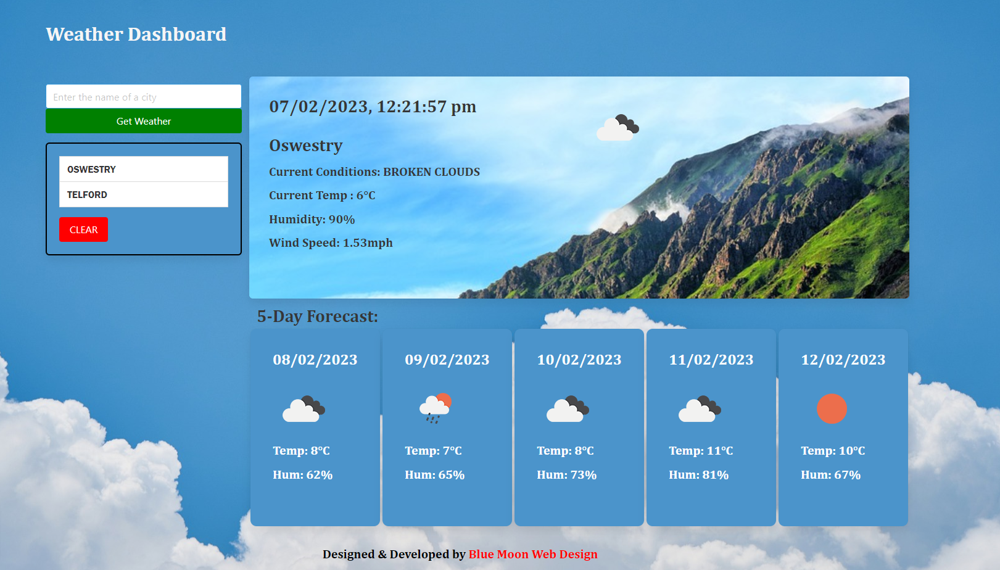

# Module 8 Server-Side APIs: Weather Dashboard

## Your Task

Server APIs allow developers to access their data and functionality by making requests with specific parameters to a URL. Developers are often tasked with retrieving data from another application's API and using it in the context of their own. Your Challenge is to build a weather dashboard that will run in the browser and feature dynamically updated HTML and CSS.

Use the 5 Day Weather Forecast Links to an external site.to retrieve weather data for cities. The base URL for your API calls should look like the following: https://api.openweathermap.org/data/2.5/forecast?lat={lat}&lon={lon}&appid={API key}. You will need to register for an API key in order to use this API. After registering for a new API key, you may need to wait up to 2 hours for that API key to activate.
 
## Acceptance Criteria

* Create a weather dashboard with form inputs.
  * When a user searches for a city they are presented with current and future conditions for that city and that city is added to the search history
  * When a user views the current weather conditions for that city they are presented with:
    * The city name
    * The date
    * An icon representation of weather conditions
    * The temperature
    * The humidity
    * The wind speed
  * When a user view future weather conditions for that city they are presented with a 5-day forecast that displays:
    * The date
    * An icon representation of weather conditions
    * The temperature
    * The humidity
  * When a user click on a city in the search history they are again presented with current and future conditions for that city

### URL:
Link to deployed application - https://tomking1983.github.io/weather-api-dashboard/

### Screenshot:

---

© 2023 edX Boot Camps LLC. Confidential and Proprietary. All Rights Reserved.
